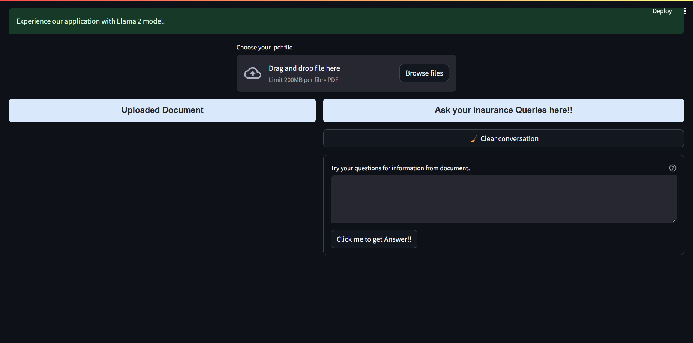
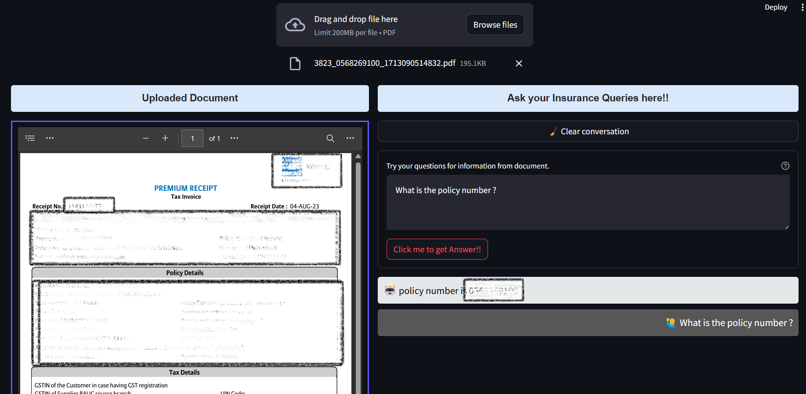

# Document RAG 
- Create virtual environment  `virtualenv --python=python3.6 venv`
- Activate virtual environment `source venv/bin/activate`
- Install requirements.txt `pip install -r requirements.txt`

### Prediction App - 
Run `streamlit run app.py` in Terminal. It will create .csv of result with misspelt_name and list of ids for each misspelt city name.

- UI for Document GenAI RAG -
- Upload file and ask quetion related to the document -

### Application web page -

